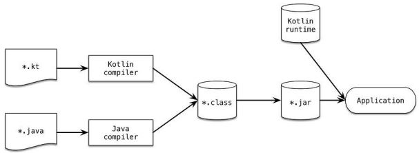

# kotlin in action ch1

### 사용성
Java 진형의 사용성을 안전하고 간결하고 편리하게 대처하기 위해 나왔다.  
Intel mutli os engine으로 ios 개발도 가능하다.  
Javascript로도 컴파일 가능하다.  

### 특성
자바와 동일하게 statically typed으로 타입을 컴파일 시점에서 알수 있어야 한다.  
- Statically typed는 장점이 있다.
    - performance, reliability, maintainability, tool support  

그치만 자바처럼 모든 타입을 명시할 필요는 없고 알아서 타입을 결정할 수 있다.  
- 이걸 type inference라고 함.  

자바의 많은 개념들이 그대로 녹아들어 있다.  
추가되는 것들은 nullable type, functional 이 있다.
그래서 object oriented 와 functional을 모두 지원한다.  

### Functional

functional의 주요 컨셉은 아래와 같다.
- first-class function, immutability, no side effect
functional의 장점은 아래와 같다.
- conciseness, safe multithreading, easier testing. 

### 철학

1. Pragmatic
   - 연구용이 아니라 실제로 사용하기 위해 디자인 되었고 많은 다른 언어들의 개념을 가져와서 사용한다.
2. Concise
   - Getter, setter, constructor param 같은 것들을 kotlin에 내장해서 간결하게 하였다.
3. Safe
   - NPE를 막을 수 있는 `?` 와 `ClassCastException`을 막기 위한 `is` 를 제공한다.
4. Interoperable
   - Java의 라이브러리들을 그대로 사용할 수 있고  java의 class나 method도 그대로 사용할 수 있다.
   - Java에서도 kotlin 거를 그대로 사용할 수 있다.
   - Kotlin은 own collection library를 갖지 않고 java standard library를 사용해서 java와 kotlin간의 어떤 wrapper나 converter가 필요하지 않다. 

### Compile

Kotlin은 java class로 컴파일되니까 java와 완전 호환된다.  
배포시에는 kotlin runtime도 넣어주어야 한다.