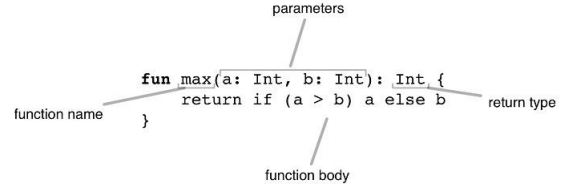

# kotlin in action ch2

## kotlin function body



kotlin의 function 구조는 위와 같다.  

## expression

Kotlin은 반복문(for, while)을 제외하고는 expression으로 판단된다. (If, when 등)
`expression`은 value를 갖는다는 점에서 statement와 차이점을 보인다.
반면 java에서는 모든 control structure들이 statement이다. 

여기서 value를 갖는다는 것은 expression 자체(expression의 결과)가 value를 갖는 것을 말한다.  
```kotlin
// 예를 들면 아래 if expression은 value를 갖고 있다.
fun max(a: Int, b: Int): Int = if (a > b) a else b
```

## expression body

Block body와 expression body로 function의 body를 구분한다.  
Block body: `{}`으로 body가 쌓여진 일반적인 함수.  
Expression body: `{}` 없이 구현된 함수. 보통 one line function에서 사용하는 함수.  

## variable

변수에 타입을 명시하지 않아도 된다.  
명시할수도 있는데, 초기 값을 넣어주지 않으면 타입 추론이 안되므로 명시해주어야 한다.  

`val`(from value): immutable (final in java)  
`var`(from variable): mutable

기본적으로 val을 사용하고, 수정이 필요한 경우만 var를 사용하도록 한다.  
var이 change value를 허락해도, type은 fix되서 바뀔 수 없다.  

`$`로 local variable에 접근할 수 있고, 이건 $(expression) 으로도 사용이 가능하다.
```kotlin
println("Hello, $name!")
println("Hello, ${if (args.size > 0) args[0] else "someone"}!")
```

## class

kotlin은 public이 default라 public을 생략할 수 있다.  
property를 선언하면 기본적으로 내부적으로 getter/setter가 같이 선언된 것이라고 보면 된다.  
그냥 class의 property를 사용하면 java의 getter를 호출해준다.  

getter/setter 외의 custom accessors를 만들 수 있다.  
custom accessors와 function을 만드는것의 차이는  
- 성능 상으로는 차이가 없다
- 가독성에만 차이가 있다

## package

kotlin에도 package가 있고 java의 package 정책과 유사하다.  
import로 class와 method를 구분하지 않고 method도 import할 수 있다.  

여러 class를 하나의 file에 넣을 수 있다.  

## enum

enum이 java랑 좀 다르다.
```kotlin
// 예제가 이해하기 편할 듯 하다.
enum class Color(
    val r: Int, val g: Int, val b: Int
) {
    RED(255, 0, 0), ORANGE(255, 165, 0),
    YELLOW(255, 255, 0), GREEN(0, 255, 0), BLUE(0, 0, 255),
    INDIGO(75, 0, 130), VIOLET(238, 130, 238);

    fun rgb() = (r * 256 + g) * 256 + b
}
>>> println(Color.BLUE.rgb())
```

## when

when과 함께 쓰일 때 enum의 효과가 더 크다.  
when은 java의 switch와 비슷한데, 더 파워풀하다.  
- any objects나 들어올 수 있다. (set 등)

no arg when 을 사용할 때도 있다.
- 가독성은 좀 떨어질 수 있다.
- 성능상 이점을 얻기 위할 때 사용할 수 있다.
- no arg이기 때문에 extra objects를 생성하지 않는다는 장점이 있다.


...