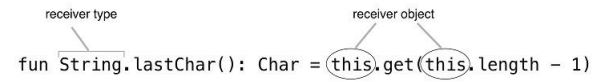
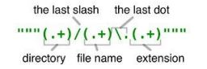

# kotlin in action ch3

## collection

setOf, listOf, mapOf로 collection을생성할 수 있다.

kotlin은 java의 collection을 사용한다.
- `.javaClass`로 class를 확인할 수 있다. (getClass()와 동일)

java의 collection을 쓰지만 더 많은 것을 지원한다.
- 예를들면 last, max와 같은 함수로, 얘네는 잠시 뒤에 다룰 extension function으로 제공된다.

## function

parameter에 naming을 할 수 있고, default value도 넣을 수 있다.
- 이건 python에서와 유사하다.

kotlin에서는 함수가 클래스 없이 존재할 수 있기 때문에,  
java에서 static method를 위해 만들었던 클래스들이 필요가 없다.
- 예를 들면 `~utils`와 같은 static method를 갖는 클래스들
- 그냥 파일 최상위에 함수가 들어가면 된다.

jvm은 클래스 안에 있는 코드만 실행이 가능하다.
- kotlin 컴파일러가 파일명을 기반으로 클래스를 내부적으로 만들어준다.
- 따라서 java에서 kotlin의 함수만 선언된 것을 사용할 때도 이런 네이밍을 맞춰서 쓸 수 있다.

변수도 클래스 없이 존재할 수 있다.
- static variable을 위한 클래스가 필요가 없어지는 것이지.
- val은 getter를, var은 getter/setter를 만드니까 우리가 쓰던 상수처럼 되지 않는다.
- const val을 써야 진짜 상수처럼 쓴다. (public static final로 컴파일 됨)

## extension function

클래스 밖에 선언된 함수를 말한다.
기존의 api를 재작성하지 않고 기능을 사용할 수 있어서, java의 클래스들의 기능을 확장하는 방식으로도 쓰인다. (위에서 보인 last, max 같이)
함수 앞에 클래스 이름을 붙이기만 하면 된다.
- 이건 약간 functional language를 위한 기능인 것 같다. golang에서도 함수를 이렇게 쓰니까



extension function에서는 클래스 안의 변수나 함수를 모두 자연스럽게 호출할 수 있다.
- 그치만 private, protected로 선언된 애들은 호출할 수 없다.

extension func를 사용하기 위해서는 다른 함수들처름 import를 해줘야 한다.
- 자동으로 된다치면 동일한 extension이 여러군데 존재할 수 있기에 문제가 생길 것.
- 이걸 응용하면 동일한 extension을 여러 개 두고 필요한 것을 import해서 쓸 수도 있지 않을까? (좋은 구조는 아닐듯)

Because extension functions are effectively just syntactic sugar over static method
calls, you can use a more specific type as a receiver type, not just a class
- 번역으로 의미 전달이 잘 안된다.
- 결국 `Collection<T>`, `Collection<String>` 이런 애들을 receiver type으로 쓸 수 있다는 거다.

extension은 `override`할 수 없다.  
부모와 자식이 동일한 extension을 갖는다면 receiver를 first argument로 넘겨준다고 생각하면 된다.  
```kotlin
fun View.showOff() = println("I'm a view!")
fun Button.showOff() = println("I'm a button!")

>>> val view: View = Button()
>>> view.showOff()

I'm a view!
```

member function과 extension function이 동일하게 존재한다면 우선순위는 member가 더 높다.

* 이렇게 기존 라이브러리(여기선 java)를 새로운 언어데서 사용하는 패턴을 Pimp My Library라고 한다.

## extension properties

`properties`는 이전에 봤던건데 난 사실 되려 더 헷갈리게 되는 것 같아서 쓸지는 모르겠다..
하여튼 extension으로 property도 만들 수 있다는 것.
- 얘는 자기가 갖고있는 field가 없다. (당연히)
- 접근할 수 있는 field가 없다면, setter를 만들지 못할 수도 있다.

## varargs

`vararg`로 가변인자를 받을 수 있다.

## infix

infix는 `.`을 생략하는 call을 말한다.  
```kotlin
1.to("one") // regular function call
1 to "one" // infix call
```

parameter가 하나 뿐인 함수에 대해 infix call을 사용할 수 있다.  
- 함수 선언 앞에 infix를 명시해줘야 한다.
`infix fun Any.to(other: Any) = Pair(this, other)`

## destructuring declaration

두 변수를 초기화할 수 있도록 하는 구현이다.
- 설명하긴 어려운데, python/golang에서 값 두 개 반환하는거랑 비슷하게 쓰이는 것 같다.

예제로 보는게 좋겠다.
```kotlin
val (number, name) = 1 to "one"

for ((index, element) in collection.withIndex()) {
    println("$index: $element")
}
```

## string

kotlin은 `String.split()`이 regular expression이 아니다.
- 자바는 기본 regular라 헷갈리고 더러워질 때가 있다.
- kotlin은 regular를 `.toRegex()`로 지원한다.

여러줄 문자열을 `""" ~ """`로 지원한다.
- 여기서 regular expression이 된다.



## local function

func 안에 func가 있는걸 local function이라고 한다.  
외부 함수의 param에 직접 접근이 가능하다.
- 이것도 functional language를 지원하기 위한 것 같다.
